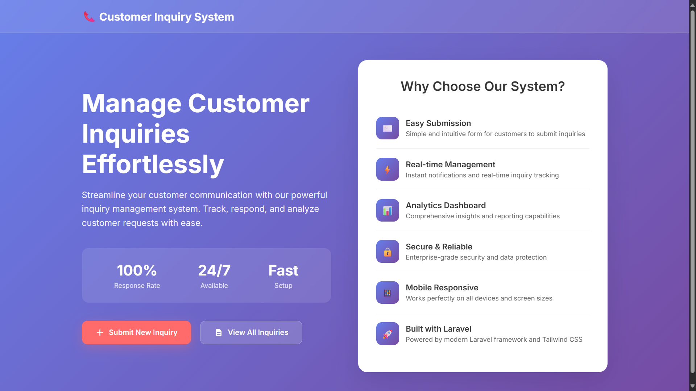

# Customer Inquiry System - Setup Instructions

## 📋 Project Overview
This is a Laravel-based Customer Inquiry Management System that allows customers to submit inquiries and administrators to manage them through a web interface.



## ✅ Prerequisites
- **PHP** (version 8.1 or higher)
- **Composer** (PHP dependency manager)
- **MySQL** or **MariaDB** database server
- **Git** (for version control)
- **Node.js** and **npm** (optional, for asset compilation)

## 🚀 Installation Steps

### Step 1: Clone the Repository
```bash
git clone https://github.com/Thisara404/Customer-Inquiry-Project.git
cd Customer-Inquiry-Project/customer-inquiries
```

### Step 2: Install Dependencies
```bash
# Install PHP dependencies
composer install

# Install Node dependencies (optional)
npm install
```

### Step 3: Environment Configuration
```bash
# Copy the environment file
cp .env.example .env

# Generate application key
php artisan key:generate
```

### Step 4: Database Setup

#### Configure Database in .env file:
```env
DB_CONNECTION=mysql
DB_HOST=127.0.0.1
DB_PORT=3306
DB_DATABASE=Customer_Inquiry
DB_USERNAME=root
DB_PASSWORD=your_password_here
```

#### Create Database:
```sql
CREATE DATABASE Customer_Inquiry;
```

### Step 5: Run Database Migrations
```bash
php artisan migrate
```

### Step 6: Start Development Server
```bash
php artisan serve
```
The application will be available at: `http://127.0.0.1:8000`

## 🎯 Project Features & Screenshots

### 📄 Pages & Functionality

#### 1. **Home Page** (`/`)
Modern responsive landing page with customer inquiry system overview and call-to-action buttons.


#### 2. **Create Inquiry** (`/inquiries/create`)
Customer information form with message submission and form validation.


#### 3. **View All Inquiries** (`/inquiries`)
List all customer inquiries with search, filter options, and CRUD operations.


#### 4. **View Single Inquiry** (`/inquiries/{id}`)
Detailed inquiry view with customer contact information and action buttons (Edit/Delete).


#### 5. **Edit Inquiry** (`/inquiries/{id}/edit`)
Update inquiry information with form validation and success notifications.


#### 6. **Delete Inquiry Confirmation**
Secure deletion process with confirmation dialog to prevent accidental data loss.


## 🗃️ Database Schema

### Inquiries Table
| Column | Type | Description |
|--------|------|-------------|
| id | bigint | Primary key |
| name | varchar(255) | Customer name |
| email | varchar(255) | Customer email |
| phone | varchar(255) | Customer phone (optional) |
| message | text | Inquiry message |
| created_at | timestamp | Creation time |
| updated_at | timestamp | Last update time |

## 🔧 Technical Stack

- **Backend**: Laravel 12.x
- **Frontend**: Blade Templates with Custom CSS
- **Database**: MySQL
- **Styling**: Custom CSS with Inter font
- **Responsive**: Mobile-first design

## 🌐 Application Routes

| Method | URI | Description |
|--------|-----|-------------|
| GET | `/` | Home page |
| GET | `/inquiries` | List all inquiries |
| GET | `/inquiries/create` | Show create form |
| POST | `/inquiries` | Store new inquiry |
| GET | `/inquiries/{id}` | View single inquiry |
| GET | `/inquiries/{id}/edit` | Show edit form |
| PUT | `/inquiries/{id}` | Update inquiry |
| DELETE | `/inquiries/{id}` | Delete inquiry |

## 🎨 Design Features

- **Modern UI**: Clean, professional interface with gradient backgrounds
- **Responsive Design**: Works perfectly on all devices and screen sizes
- **Custom Styling**: Beautiful gradients and smooth animations
- **Form Validation**: Client and server-side validation with error messages
- **Success Messages**: User feedback notifications for all actions
- **Loading States**: Smooth transitions and hover effects
- **Card-based Layout**: Clean card design for inquiry listings
- **Mobile-First**: Optimized for mobile devices

## 🛠️ Development Commands

```bash
# Start development server
php artisan serve

# Run migrations
php artisan migrate

# Clear caches
php artisan cache:clear
php artisan config:clear
php artisan view:clear

# Generate application key
php artisan key:generate
```

## 🎯 Key Functionality Highlights

### ✨ **User Experience Features:**
- **Intuitive Navigation**: Easy-to-use interface with clear navigation
- **Real-time Feedback**: Instant validation and success messages
- **Professional Design**: Modern gradient backgrounds with clean typography
- **Responsive Layout**: Seamless experience across all devices

### 🔧 **Technical Features:**
- **Laravel Framework**: Built with Laravel 12.x for robust backend
- **Custom CSS**: Hand-crafted styles with Inter font family
- **Form Validation**: Comprehensive validation on both client and server side
- **Database Integration**: MySQL database with proper migrations
- **CRUD Operations**: Complete Create, Read, Update, Delete functionality

### 📱 **Mobile Responsiveness:**
- **Mobile-First Design**: Optimized for mobile devices
- **Flexible Grid System**: Adapts to different screen sizes
- **Touch-Friendly Interface**: Proper button sizes and spacing

## 📝 Contributing

1. Fork the repository
2. Create your feature branch (`git checkout -b feature/AmazingFeature`)
3. Commit your changes (`git commit -m 'Add some AmazingFeature'`)
4. Push to the branch (`git push origin feature/AmazingFeature`)
5. Open a Pull Request

## 📞 Support

If you encounter any issues:
1. Check the Laravel documentation: https://laravel.com/docs
2. Ensure all prerequisites are installed
3. Verify database configuration in [.env](customer-inquiries/.env)
4. Check file permissions
5. Review error logs in `storage/logs/`

## 🌟 Project Highlights

This Customer Inquiry System demonstrates:
- **Professional Laravel Development**
- **Modern UI/UX Design Principles**
- **Responsive Web Development**
- **Database Design and Management**
- **Form Handling and Validation**
- **CRUD Operations Implementation**

## 📂 Project Structure

```
customer-inquiries/
├── app/
│   ├── Http/Controllers/
│   │   └── InquiryController.php
│   └── Models/
│       └── Inquiry.php
├── database/
│   └── migrations/
│       └── 2025_07_27_033003_create_inquiries_table.php
├── resources/views/
│   ├── welcome.blade.php
│   └── inquiries/
│       ├── index.blade.php
│       ├── create.blade.php
│       ├── show.blade.php
│       └── edit.blade.php
├── routes/
│   └── web.php
└── .env
```

## 📄 License

This project is open-sourced software licensed under the [MIT license](https://opensource.org/licenses/MIT).

---

**Made with ❤️ using Laravel Framework**

### 🔗 **Live Demo**
Visit the application at: `http://127.0.0.1:8000` after following the installation steps.

### 👨‍💻 **Developer**
Created by [Thisara404](https://github.com/Thisara404)

---
*Screenshots showcase the complete functionality and modern design of the Customer Inquiry Management System.*
